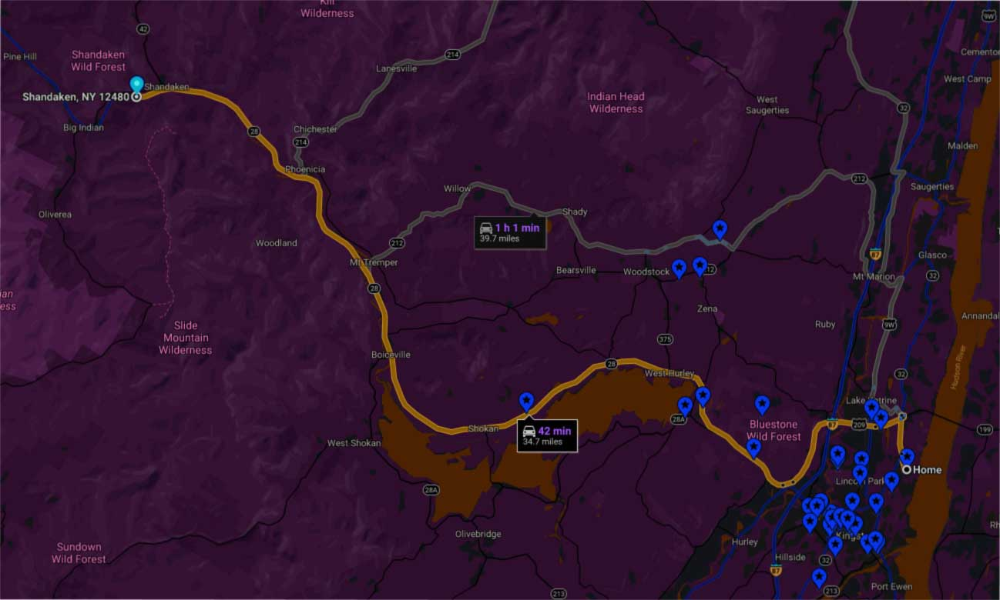

# SS 2020
## super secret event at a super secret location for a super secret person

- sunday, june 21, 2020
- 4 pm until dusk, dark, midnight, dawn, mid-morning, noon
- call 845-663-1232 for location
- Probably no cell service so be prepared
- Five mins from lot to water

## what to bring
- swim trunks
- creature comforts
  - chairs
  - blankets
- food
- drink
- musical instruments
- fishing gear
- camp kit if you like
- loved ones

## suggestions

- sing something
- dance with abandon
- teach us something
  - constellations
  - ecology
  - geography
  - geomorphology
  - a tune
  - feasting
  - foraging
  - activism
  - community building

- read poetry to yourself or to the gathered
- tell a ghost story
- tell us what you've been up for the past six months

## safety
- safety is a priority
- do not broadcast this info on radio, print on flyer, mass forward or share on social media
- event will be entirely outside
- plenty of space
- fresh air
- sunshine
- breeze
- set your social distancing boundaries as you need

## original details
- sunday, june 21, 2020 at 4 pm
- starts at 4 - goes til at least 9 
- come and go on your own time
- swimming
- music
- bring yo food
- bring yo drink
- bring yo blankets, chairs
- bring yo loved ones
- bring yo musical axes/axis
- sing something
- teach us something
- read poetry to yourself or to the gathered
- within 90 mins of Kingston
- but less actually
- you WOULD drive there even if it WAS 90 mins away
- pandemic good times, upstate style
- outdoor event
- choose your own social distance
- RSVP by text, tin-can telephone, messenger, morse code, semaphores for directions/info to be sent at approx 2 pm sunday
- don't touch that dial
- keep it tuned here
- [refresh](https://matthewfass.com/super-secret-2020/)
- oh wait, did we mention it's the solstice?

#### max
[917-497-7852](tel:917-497-7852)
[email](mailto:matthewfass@gmail.com)
[FB](https://www.facebook.com/matthewfass/) — [-- .- -..-](https://en.wikipedia.org/wiki/Morse_code#/media/File:International_Morse_Code.svg) 

